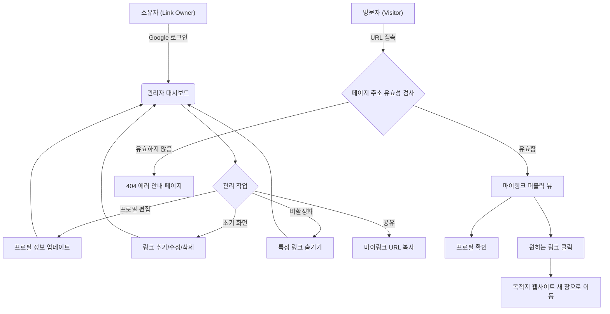

# 마이링크 (MyLink) 와이어프레임 및 사용자 플로우

## 1. 사용자 전체 흐름 (User Flow)
Mermaid 다이어그램을 활용하여 방문자와 소유자의 전체적인 애플리케이션 흐름을 정의합니다.



---

## 2. 화면 와이어프레임 (ASCII Art)

### 2.1 마이링크 퍼블릭 뷰 (방문자 화면 - Mobile)
모바일 환경에 최적화된 심플하고 직관적인 방문자 화면 와이어프레임입니다.

```text
+-----------------------------------+
|                                   |
|   [ 🔗 공유 ]            [ ⚙️ 메뉴] |
|                                   |
|             ( 😃 )                |
|           프로필 사진                 |
|                                   |
|            @username              |
|        마이링크 (DisplayName)       |
|     안녕하세요! 제 링크 모음입니다.      |
|                                   |
|  +-----------------------------+  |
|  | [🎨] 개인 포트폴리오 웹사이트  |  |
|  +-----------------------------+  |
|                                   |
|  +-----------------------------+  |
|  | [📸] 인스타그램               |  |
|  +-----------------------------+  |
|                                   |
|  +-----------------------------+  |
|  | [💻] 깃허브                   |  |
|  +-----------------------------+  |
|                                   |
|                                   |
|      ⚡ Powered by MyLink        |
+-----------------------------------+
```

### 2.2 관리자 대시보드 (소유자 화면 - Desktop PC)
링크 관리 기능과 더불어, 우측에 현재 어떻게 보이는지 확인할 수 있는 실시간 모바일 모의 화면 기능이 포함된 대시보드입니다.

```text
+-------------------------------------------------------------------------+
| [MyLink 로고]   내 링크 | 디자인 | 통계 | 설정             (😃) 로그아웃 |
+-------------------------------------------------------------------------+
|                                  |                                      |
|  [ URL 복사: mylink.com/user ]   |       [ 실시간 모바일 미리보기 ]        |
|                                  |                                      |
|  +----------------------------+  |       +--------------------------+   |
|  | ✏️ 프로필 편집 (사진/이름/소개) |  |       |        [ 🔗 ]  [ ⚙️ ]    |   |
|  +----------------------------+  |       |          ( 😃 )          |   |
|                                  |       |        @username         |   |
|  [ + 새 링크 추가하기 ]             |       |       소개글 영역...         |   |
|                                  |       |                          |   |
|  =  [🎨] 포트폴리오                |       |  +--------------------+  |   |
|     https://portfolio.com        |       |  | [🎨] 포트폴리오      |  |   |
|     [수정] [삭제]           (ON) |       |  +--------------------+  |   |
|  ------------------------------  |       |                          |   |
|  =  [📸] 인스타그램                |       |  +--------------------+  |   |
|     https://instagram.com/..     |       |  | [📸] 인스타그램      |  |   |
|     [수정] [삭제]           (ON) |       |  +--------------------+  |   |
|  ------------------------------  |       |                          |   |
|  =  [💻] 깃허브                    |       |  +--------------------+  |   |
|     https://github.com/..        |       |  | [💻] 깃허브          |  |   |
|     [수정] [삭제]          (OFF) |       |  +--------------------+  |   |
|                                  |       +--------------------------+   |
+-------------------------------------------------------------------------+
```

### 2.3 빈 화면 상태 (Empty State - No Links)
사용자가 공간을 처음 생성했거나 등록된 링크가 0개일 때 나타나는 안내 화면(좌측 링크 관리 영역)입니다.

```text
+-------------------------------------------------------------------------+
|                                                                         |
|                       📭 링크가 비어있습니다                                 |
|                                                                         |
|                아직 방문자에게 보여줄 링크를 등록하지 않았습니다.                 |
|            아래 버튼을 눌러 첫 번째 소셜 미디어나 웹사이트를 추가해 보세요!          |
|                                                                         |
|                      [ + 첫 번째 링크 추가하기 ]                            |
|                                                                         |
+-------------------------------------------------------------------------+
```
